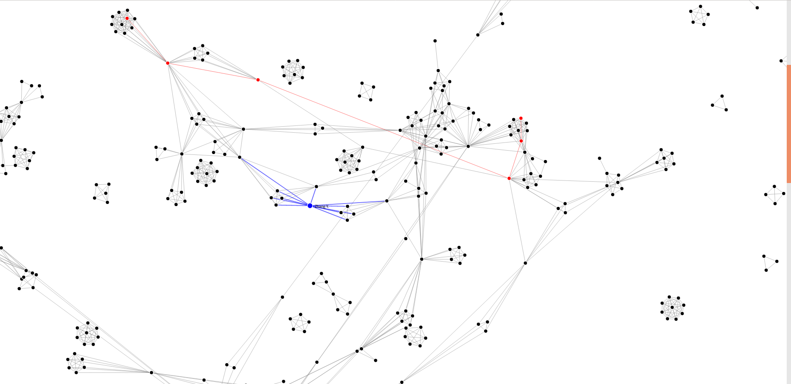

# VisGraph
Force-directed graph visualiztion with interaction, 
homework for information visualization course, School of Software, Tsinghua University.
This project utilizes force-directed graph to visualize coauthor graph and 
provides highlight for mouse hovering and shortest path.
## src
- `build_citation_graph.py`: build citation graph from csv files 
where nodes represent papers and edges represent citation links
- `build_coauthor_graph.py`: build coauthor graph from csv files
where nodes represent paper authors and edges represent coauthor links
- `citation.json`: citation graph json file, with pre-computed shortest paths
- `coauthor.json`: coauthor graph json file, with pre-computed shortest paths
- `index.html`: visualization and interaction by `d3.js`
- `scopus_visual_analytics_part1.csv`, `scopus_visual_analytics_part2.csv`: paper meta source file
- `test.json`: small-scale dataset for visualization algorithm testing
## Instructions
- Loading data and rendering graphs may take a while
- When the mouse hovers on the node, the node and the edges concerning with the nodes is highlighted with color `blue` 
and the name of the node appears
- When clicking two connected nodes, the shortest path between these two nodes is highlighted with color `red`

